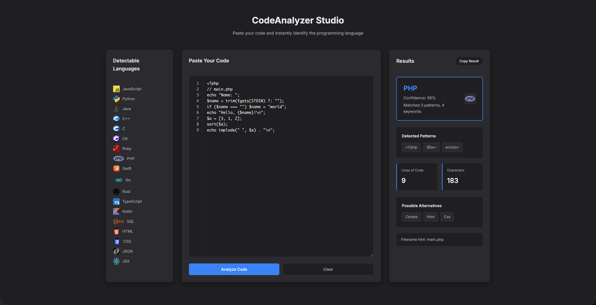

# CodeAnalyzer Studio

A client-side web app that detects the programming language of pasted code using pattern- and keyword-based heuristics.



## Project Structure
```text
Code-Analyzer/
├── index.html        # App markup
├── styles.css        # Styling
├── script.js         # Detection logic and UI behavior
├── README.md         # Project documentation
└── images/           # Language/logo assets
```

## Run
1. Quick start: open `index.html` directly in a browser.
2. Local server option:
   - From `Code-Analyzer/`, run:
     ```bash
     python3 -m http.server 8000
     ```
   - Open `http://localhost:8000` in your browser.

## Requirements
- A modern web browser
- Optional: Python 3 (only needed if you want to run a local server)

## Browser Support
- Google Chrome (recent versions)
- Microsoft Edge (recent versions)
- Mozilla Firefox (recent versions)
- Safari (recent versions)

## How to Use
1. Paste code into the center editor panel.
2. Press `Enter` to analyze (use `Shift+Enter` to add a new line), press `Ctrl+Enter`/`Cmd+Enter`, or click `Detect Language`.
3. See the detected language, confidence, and stats.
4. Use `Copy Result` to copy the full report.
5. Use `Clear` to reset the input and results.

## How It Works
- Each language has regex patterns and keyword lists in `languagePatterns` inside `script.js`.
- Matches add to a score per language; the highest score wins.
- Confidence is derived from the top score vs. total score.
- Extra boosts exist for TypeScript-only syntax (type annotations, `interface`, `type`, etc.) and filename hints (e.g., `// main.ts`).
- Very large inputs are truncated to the first 20,000 characters for performance.

## Features
- Heuristic language detection with a confidence score
- Line numbers and code stats (lines/characters)
- Detectable languages list with logos
- `Copy Result` button with a full report (language, confidence, stats, patterns, alternatives)
- Filename hint detection (e.g., `// main.ts`)
- Performance guard for large inputs
- Match explanation (pattern/keyword counts)

## Limitations
- Detection is heuristic-based and can be inaccurate for short snippets.
- Mixed-language code blocks can reduce confidence and accuracy.
- Closely related syntaxes (for example JavaScript/TypeScript/JSX) may be harder to distinguish in minimal samples.

## Privacy
- All analysis runs locally in your browser.
- No code is uploaded to a backend service.
- Local storage may be used for legacy history persistence.

## Roadmap
- Improve disambiguation between JavaScript, TypeScript, and JSX.
- Add optional syntax highlighting in the editor panel.
- Expand language pattern coverage and tuning.
- Add sample snippets for quick testing.
- Expose history tools in the UI or remove legacy history code.

## Detectable Languages
- JavaScript
- Python
- Java
- C++
- C
- C#
- Ruby
- PHP
- Swift
- Go
- Rust
- TypeScript
- Kotlin
- SQL
- HTML
- CSS
- JSON
- JSX

## Notes
- No server or build step required.
- Legacy history persistence exists in localStorage even though it is not currently exposed in the UI.
